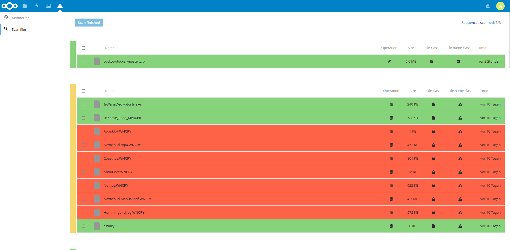

# Nextcloud Ransomware Detection

**Ransomware detection with a guided user-controlled one-step recovery.**

This app monitors file operations during the synchronization to detect ransomware attacks and also offers a post infection file storage scanner, which works even if it happend that you didn't have this app installed during an attack. This is done by using generic indicators for a guided user-controlled one-step recovery utilizing the integrated file versioning methods.

## Features

* :exclamation:**Ransomware Detection:** Monitoring the file operations, analysing and classifying the collected data by using generic indicators allows a reliable detection.
* :mag_right:**Ransomware Scanner:** Scan your file storage after a ransomware attack - which even works without the app being installed during the infection - to easily recover your data and clean up your storage. This may take some time depending on how many files you have stored on your cloud storage.
* :computer:**Recovery Interface:**  The color coded results of the classification offer an easy-to-use recovery interface giving the user full control of the recovery process.
* :relaxed:**Guided Undo:** The guided user-controlled one-step recovery allows the user to quick and savely restore all - by ransomware - encrypted files without being affected by any false positives.
