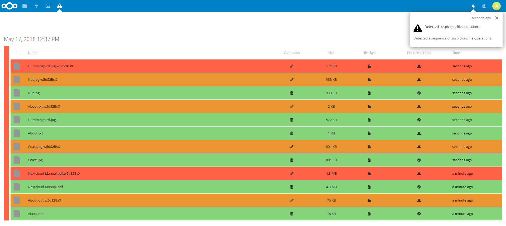

# Nextcloud Ransomware Detection

**Ransomware detection with guided user-controlled recovery.**

This app monitors file operations and groups them into activity intervals to detect ransomware attacks using generic indicators.
Generic ransomware indicators analyze and classify these activity intervals applying a color coding for a guided user-controlled recovery.

## Features

* **Ransomware Detection:** Monitoring the file operations, analysing and classifying the collected data by using generic indicators allows a reliable detection.
* **Recovery Interface:**  The color coded results of the classification offer an easy-to-use recovery interface giving the user full control of the recovery process.
* **Guided Undo:** The guided user-controlled recovery allows the user to quick and savely restore all - by ransomware - encrypted files without being affected by any false positives.
